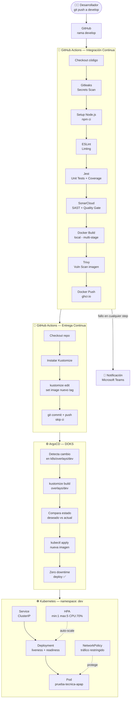

# Prueba Técnica — Ingeniero DevOps Middle
### APAP · Automatizaciones TI · Marzo 2026

> Pipeline CI/CD completo con GitOps, Kubernetes y ArgoCD para una API REST Node.js desplegada en DigitalOcean Kubernetes Service (DOKS).

---

## Tabla de Contenidos

- [Arquitectura](#arquitectura)
- [Stack Tecnológico](#stack-tecnológico)
- [Estructura del Repositorio](#estructura-del-repositorio)
- [Requisitos Previos](#requisitos-previos)
- [Instalación y Uso Local](#instalación-y-uso-local)
- [Pipeline CI/CD](#pipeline-cicd)
- [Kubernetes y GitOps con ArgoCD](#kubernetes-y-gitops-con-argocd)
- [Seguridad](#seguridad)
- [Bonus Implementados](#bonus-implementados)
- [Decisiones Técnicas](#decisiones-técnicas)

---

## Arquitectura

Flujo completo desde el push del desarrollador hasta el despliegue en Kubernetes:



---

## Stack Tecnológico

| Categoría | Herramienta | Decisión |
|---|---|---|
| **Runtime** | Node.js LTS (alpine) | Imagen base oficial, ligera y segura |
| **CI/CD** | GitHub Actions | Integración nativa con el repositorio |
| **Registry** | ghcr.io (GitHub) | Gratuito, integrado con GitHub Actions |
| **Orquestación** | Kubernetes — DOKS | Clúster managed en DigitalOcean |
| **GitOps** | ArgoCD | Sincronización automática del estado deseado |
| **Manifiestos** | Kustomize | Gestión de ambientes sin duplicación de YAMLs |
| **SAST** | SonarCloud | Análisis estático de código en la nube (tier gratuito) |
| **Vuln Scan** | Trivy | Escaneo de CVEs en la imagen Docker |
| **Secrets Scan** | Gitleaks | Detección de secretos expuestos en el repositorio |
| **Linting** | ESLint | Calidad y consistencia del código JavaScript |
| **Testing** | Jest + Supertest | Pruebas unitarias con cobertura |
| **Notificaciones** | Microsoft Teams | Alertas en caso de fallo del pipeline |

---

## Estructura del Repositorio

```
prueba-tecnica/
├── src/
│   ├── app.js                  # Módulo Express (exporta la app)
│   └── index.js                # Entry point del servidor
├── test/
│   └── app.test.js             # Pruebas unitarias (Jest + Supertest)
├── k8s/
│   ├── base/
│   │   ├── deployment.yaml     # Deployment con probes y recursos
│   │   ├── service.yaml        # Service ClusterIP
│   │   ├── hpa.yaml            # Horizontal Pod Autoscaler
│   │   ├── networkpolicy.yaml  # Restricción de tráfico entre pods
│   │   └── kustomization.yaml  # Base Kustomize
│   ├── overlays/
│   │   ├── dev/                # 1 réplica — namespace dev
│   │   ├── qa/                 # 2 réplicas — namespace qa
│   │   └── prod/               # 3 réplicas — namespace prod
│   ├── argocd-app.yaml         # Application CRD de ArgoCD
│   ├── ingress.yaml            # Ingress con TLS para exposición pública
│   └── base/
│       └── clusterissuer.yaml  # ClusterIssuer Let's Encrypt
├── .github/
│   └── workflows/
│       └── pipeline.yml        # Pipeline CI/CD
├── Dockerfile                  # Multi-stage build
├── eslint.config.js            # Configuración ESLint
├── sonar-project.properties    # Configuración SonarCloud
├── .dockerignore
├── .gitignore
├── values.yaml                 # Configuración Helm para kube-prometheus-stack
└── package.json
```

---

## Requisitos Previos

- Node.js >= 18.x
- Docker Desktop
- kubectl configurado con acceso al clúster
- Acceso a DigitalOcean Kubernetes (DOKS)
- ArgoCD instalado en el clúster

---

## Instalación y Uso Local

### 1. Clonar el repositorio

```bash
git clone https://github.com/LuiTzY/PRUEBA-TECNICA-APAP
cd PRUEBA-TECNICA-APAP
npm install
```

### 2. Correr la aplicación localmente

```bash
npm start
```

La API estará disponible en `http://localhost:3000`

### 3. Endpoints disponibles

| Método | Ruta | Descripción |
|---|---|---|
| GET | `/` | Mensaje principal |
| GET | `/health` | Health check |
| GET | `/api/info` | Información de la API |

### 4. Ejecutar pruebas

```bash
npm test          # pruebas + cobertura
npm run lint      # análisis ESLint
```

### 5. Construir imagen Docker localmente

```bash
docker build -t prueba-tecnica-apap:local .
docker run -p 3000:3000 prueba-tecnica-apap:local

# Verificar
curl http://localhost:3000
curl http://localhost:3000/health

# Verificar healthcheck (esperar ~30s)
docker inspect --format='{{.State.Health.Status}}' <container_id>
```

### 6. Secrets requeridos en GitHub Actions

| Secret | Descripción |
|---|---|
| `SONAR_TOKEN` | Token generado en SonarCloud al crear el proyecto |
| `GITOPS_TOKEN` | Personal Access Token con permisos `repo` |
| `MS_TEAMS_WEBHOOK_URI` | URL del Incoming Webhook de Microsoft Teams |

---

## Pipeline CI/CD

### Disparadores

| Evento | Rama | Jobs ejecutados |
|---|---|---|
| `push` | `develop` | CI + CD |
| `pull_request` | `main`, `master` | Solo CI |

### Flujo CI — Integración Continua

```
1.  Checkout del código           fetch-depth: 0 necesario para SonarCloud
2.  Gitleaks                      Detección de secretos expuestos en el repo
3.  Setup Node.js + npm ci        Instalación limpia y reproducible
4.  ESLint                        Análisis de calidad y estilo de código
5.  Jest --coverage               Pruebas unitarias + reporte de cobertura
6.  Publicar artefacto coverage   Disponible en la UI de GitHub Actions
7.  SonarCloud SAST               Quality Gate — bloquea si no cumple umbrales
8.  Docker Build (local)          Imagen en runner para escaneo con Trivy
9.  Trivy scan                    Escaneo de CVEs — falla si hay CRITICAL
10. Publicar reporte Trivy        Disponible en la UI de GitHub Actions
11. Docker Push a ghcr.io         Solo en push (no en PRs)
12. Notificación Teams            Solo si algún step anterior falló
```

### Flujo CD — Entrega Continua

```
1. Checkout del repo (mismo repo — patrón GitOps en monorepo)
2. Instalar Kustomize
3. Convertir IMAGE_NAME a minúsculas (requisito de ghcr.io)
4. kustomize edit set image → nuevo tag (sha-xxxxxxx)
5. git commit + push [skip ci]
   → ArgoCD detecta el cambio y despliega automáticamente
```

> **Nota:** El `[skip ci]` en el commit del CD evita que el pipeline de CI se dispare nuevamente al hacer push de la actualización del tag, previniendo un loop infinito.

---

## Kubernetes y GitOps con ArgoCD

### Estrategia Kustomize

La base define los recursos comunes. Cada overlay solo sobreescribe lo que cambia por ambiente:

| Overlay | Namespace | Réplicas | Imagen |
|---|---|---|---|
| `dev` | dev | 1 | tag del último commit |
| `qa` | qa | 2 | tag del último commit |
| `prod` | prod | 3 | tag del último commit |

### Instalar ArgoCD en el clúster

```bash
kubectl create namespace argocd
kubectl apply -n argocd -f https://raw.githubusercontent.com/argoproj/argo-cd/stable/manifests/install.yaml

# Acceder a la UI
kubectl port-forward svc/argocd-server -n argocd 8080:443

# Obtener contraseña inicial
kubectl -n argocd get secret argocd-initial-admin-secret \
  -o jsonpath="{.data.password}" | base64 -d
```

### Desplegar la Application de ArgoCD

```bash
kubectl apply -f k8s/argocd-app.yaml
```

### Configuración de ArgoCD

| Feature | Estado | Descripción |
|---|---|---|
| Auto-sync | ✅ | Despliega automáticamente al detectar cambios en Git |
| Self-heal | ✅ | Revierte cambios manuales hechos fuera de Git |
| Prune | ✅ | Elimina recursos que ya no están en el repositorio |
| CreateNamespace | ✅ | Crea el namespace automáticamente si no existe |
| Retry con backoff | ✅ | 3 intentos con espera exponencial (10s, 20s, 40s) |

### Verificar el despliegue

```bash
# Ver estado de los pods
kubectl get pods -n dev

# Acceder a la app desplegada
kubectl port-forward svc/prueba-tecnica-apap-dev 8081:80 -n dev

# Probar los endpoints
curl http://localhost:8081
curl http://localhost:8081/health
curl http://localhost:8081/api/info
```

---

## Seguridad

Seguridad aplicada en múltiples capas del flujo:

| Capa | Herramienta | Qué protege |
|---|---|---|
| **Repositorio** | Gitleaks | Secretos hardcodeados en el código o historial de Git |
| **Código** | ESLint | Errores, malas prácticas y código inconsistente |
| **Código** | SonarCloud | Bugs, vulnerabilidades y code smells con Quality Gate |
| **Imagen** | Trivy | CVEs en dependencias de sistema y librerías npm |
| **Contenedor** | Usuario non-root | Previene escalada de privilegios en el contenedor |
| **Imagen** | Multi-stage build | Sin devDependencies ni herramientas de build en producción |
| **Red** | NetworkPolicy | Restringe el tráfico entre pods dentro del clúster |
| **Secrets** | GitHub Secrets | Credenciales nunca expuestas en el código |

---

## Ingress con TLS

La aplicación está expuesta públicamente con HTTPS usando NGINX Ingress Controller y cert-manager con Let's Encrypt.

**URL pública:** `https://138-197-231-69.nip.io`

### Instalación

```bash
# NGINX Ingress Controller
helm repo add ingress-nginx https://kubernetes.github.io/ingress-nginx
helm repo update
helm install ingress-nginx ingress-nginx/ingress-nginx \
  --namespace ingress-nginx \
  --create-namespace

# cert-manager
helm repo add jetstack https://charts.jetstack.io
helm repo update
helm install cert-manager jetstack/cert-manager \
  --namespace cert-manager \
  --create-namespace \
  --set crds.enabled=true

# ClusterIssuer y Ingress
kubectl apply -f k8s/base/clusterissuer.yaml
kubectl apply -f k8s/ingress.yaml
```

### Verificar el certificado TLS

```bash
kubectl get certificate -n dev
# READY = True significa que el certificado fue emitido correctamente
```

### Cómo funciona

```
Internet
    │
    ▼
NGINX Ingress Controller (IP: 138.197.231.69)
    │  TLS terminado aquí con certificado Let's Encrypt
    │  cert-manager renueva automáticamente cada 90 días
    ▼
Service prueba-tecnica-apap-dev (ClusterIP)
    │
    ▼
Pod prueba-tecnica-apap ✅
```

> **Nota:** Se usa `nip.io` como dominio ya que es un servicio DNS gratuito que resuelve cualquier IP automáticamente. En producción se reemplazaría por un dominio real.

---

## Monitoreo — Prometheus + Grafana

El monitoreo del clúster se implementó usando el chart oficial `kube-prometheus-stack` de Helm, desplegado en el mismo clúster DOKS en el namespace `monitoring`.

### Instalación

```bash
# Agregar el repositorio de Helm
helm repo add prometheus-community https://prometheus-community.github.io/helm-charts
helm repo update

# Instalar el stack con el values.yaml del repo
helm install kube-prometheus-stack prometheus-community/kube-prometheus-stack \
  --namespace monitoring \
  --create-namespace \
  -f values.yaml
```

### Configuración (`values.yaml`)

```yaml
prometheus:
  service:
    type: NodePort
grafana:
  service:
    type: NodePort
```

Los servicios se exponen como `NodePort` para poder acceder desde fuera del clúster sin necesitar un LoadBalancer adicional.

### Acceder a los dashboards

```bash
# Obtener el puerto de Grafana
kubectl get svc -n monitoring kube-prometheus-stack-grafana

# O via port-forward
kubectl port-forward svc/kube-prometheus-stack-grafana 3000:80 -n monitoring
```

Credenciales por defecto: `admin` / `prom-operator`

### Qué monitorea

- Métricas del clúster: CPU, memoria, disco por nodo
- Estado de los pods y deployments
- Métricas de Kubernetes (kube-state-metrics)
- Alertas automáticas configuradas por defecto

---

## Bonus Implementados

| # | Bonus | Implementación |
|---|---|---|
| 1 | HPA — Horizontal Pod Autoscaler | `k8s/base/hpa.yaml` — escala de 1 a 5 réplicas al 70% CPU |
| 2 | Network Policies | `k8s/base/networkpolicy.yaml` — restringe tráfico entre pods |
| 3 | ESLint en el pipeline | Step antes de las pruebas en `pipeline.yml` |
| 4 | Notificaciones Teams en fallo | Step con `if: failure()` al final del job CI |
| 5 | Gitleaks — secrets scanning | Step inmediatamente después del checkout |
| 7 | Ingress Controller con TLS | NGINX + cert-manager + Let's Encrypt — `k8s/ingress.yaml` |
| 9 | Prometheus + Grafana | `kube-prometheus-stack` via Helm, `values.yaml` en raíz del repo |
| 10 | Rollback automático en ArgoCD | `retry.limit: 3` con backoff exponencial en `argocd-app.yaml` |

---

## Decisiones Técnicas

**¿Por qué GitHub Actions y no Azure DevOps o GitLab CI?**
GitHub Actions ofrece integración nativa con el repositorio sin infraestructura adicional. El `GITHUB_TOKEN` automático simplifica la autenticación con `ghcr.io` y reduce la gestión de secretos. Para un proyecto en GitHub es la opción más directa.

**¿Por qué `ghcr.io` como registry?**
Gratuito para repositorios públicos, integrado con GitHub Actions mediante el `GITHUB_TOKEN` automático. No requiere crear cuentas adicionales ni gestionar credenciales extra.

**¿Por qué Kustomize sobre Helm?**
Para este caso de uso, Kustomize es más simple y directo. No requiere templates complejos — solo overlays que sobreescriben valores específicos por ambiente. Helm agrega complejidad innecesaria cuando no hay lógica condicional en los manifiestos.

**¿Por qué DigitalOcean Kubernetes (DOKS)?**
Clúster managed con kubeconfig listo para usar, costo accesible y la API de Kubernetes es estándar — los mismos manifiestos funcionan en EKS, AKS o GKE sin modificaciones.

**¿Por qué `node:current-alpine3.22` como imagen base?**
Alpine es una distribución Linux minimalista que reduce drásticamente el tamaño de la imagen y la superficie de ataque. El multi-stage build además garantiza que las devDependencies (Jest, ESLint, Supertest) nunca lleguen a la imagen de producción.

**¿Por qué SonarCloud y no SonarQube local?**
SonarCloud no requiere infraestructura adicional, se integra con GitHub Actions mediante una action oficial y su tier gratuito es suficiente para proyectos públicos. El Quality Gate bloquea el pipeline automáticamente si el código no cumple los umbrales definidos.

**¿Por qué el mismo repo para GitOps?**
Para esta prueba técnica, un monorepo simplifica el flujo y la revisión del código. En producción se recomienda separar el repositorio de código del repositorio GitOps para mantener historiales limpios y control de acceso diferenciado.